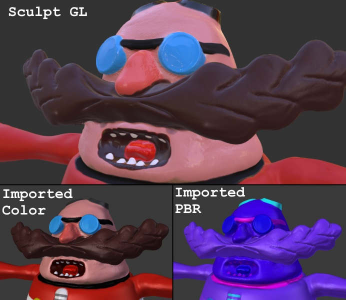
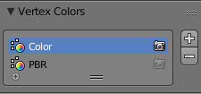

# Blender SculptGL Importer

Simple importer script for Blender, that can import models from SculptGL files (.sgl) with PBR information

### Currently supports:
- .sgl Version 3
- Triangle meshes
- **Color** information
- **PBR** information

### Does not supports:
- UV
- Quad Meshes

Color and PBR information stored in vertex colors  

PBR channel mapping is:
- **Red**: Roughness
- **Green**: Metallic
- **Blue**: Masking (From masking tool, not related to PBR, but original file stores mask in same array)

I didn't tested it much, but seems like any model sculpted from scratch in current version will load just fine.

# Installation info
- Download Zip of this repository
- Go to **File** -> **User Preferences** -> **Addons**
- Click **Install from File** and open downloaded file
- Find and enable it in Addons, under **Import-Export** tab
- Click **Save User Settings**

Then you can import your files using **File** -> **Import** -> **Sculpt GL (.sgl)**
